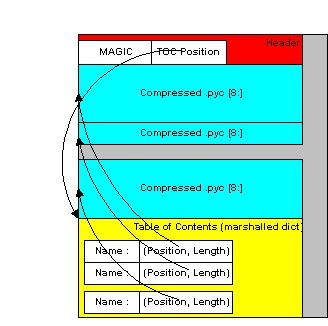

Advanced Topics
================

The following discussions cover details of |PyInstaller| internal methods.
You should not need this level of detail for normal use,
but such details are helpful if you want to investigate
the |PyInstaller| code and possibly contribute to it,
as described in `How to Contribute`_.

.. _the bootstrap process in detail:

The Bootstrap Process in Detail
~~~~~~~~~~~~~~~~~~~~~~~~~~~~~~~~~~

There are many steps that must take place before the bundled
script can begin execution.
A summary of these steps was given in the Overview
(:ref:`How the One-Folder Program Works` and
:ref:`How the One-File Program Works`).
Here is more detail to help you understand what the |bootloader|
does and how to figure out problems.

Bootloader
----------

The bootloader prepares everything for running Python code.
It begins the setup and then returns itself in another process.
This approach of using two processes allows a lot of flexibility
and is used in all bundles except one-folder mode in Windows.
So do not be surprised if you will see your bundled app
as  two processes in your system task manager.

What happens during execution of bootloader:

A. First process: bootloader starts.

    1. If one-file mode, extract bundled files to
       :file:`{temppath}/_MEI{xxxxxx}`.

    2. Modify various environment variables:

       - GNU/Linux: If set, save the original value of LD_LIBRARY_PATH
         into LD_LIBRARY_PATH_ORIG.
         Prepend our path to LD_LIBRARY_PATH.

       - AIX: same thing, but using LIBPATH and LIBPATH_ORIG.

       - OSX: unset DYLD_LIBRARY_PATH.

    3. Set up to handle signals for both processes.

    4. Run the child process.

    5. Wait for the child process to finish.

    6. If one-file mode, delete :file:`{temppath}/_MEI{xxxxxx}`.

B. Second process: bootloader itself started as a child process.

    1. On Windows set the `activation context`_.

    2. Load the Python dynamic library.
       The name of the dynamic library is embedded in the
       executable file.

    3. Initialize Python interpreter: set sys.path, sys.prefix, sys.executable.

    4. Run python code.

Running Python code requires several steps:

1. Run the Python initialization code which
   prepares everything for running the user's main script.
   The initialization code can use only the Python built-in modules
   because the general import mechanism is not yet available.
   It sets up the Python import mechanism to load modules
   only from archives embedded in the executable.
   It also adds the attributes ``frozen``
   and ``_MEIPASS`` to the :mod:`sys` built-in module.

2. Execute any run-time hooks: first those specified by the
   user, then any standard ones.

3. Install python "egg" files.
   When a module is part of a zip file (.egg),
   it has been bundled into the :file:`./eggs` directory.
   Installing means appending .egg file names to :data:`sys.path`.
   Python automatically detects whether an
   item in :data:`sys.path` is a zip file or a directory.

4. Run the main script.

Python imports in a bundled app
-------------------------------------

|PyInstaller| embeds compiled python code
(``.pyc`` files) within the executable.
|PyInstaller| injects its code into the
normal Python import mechanism.
Python allows this;
the support is described in :pep:`302`  "New Import Hooks".

PyInstaller implements the PEP 302 specification for
importing built-in modules,
importing "frozen" modules (compiled python code
bundled with the app) and for C-extensions.
The code can be read in :file:`./PyInstaller/loader/pyi_mod03_importers.py`.

At runtime the PyInstaller :pep:`302` hooks are appended
to the variable :data:`sys.meta_path`.
When trying to import modules the interpreter will
first try PEP 302 hooks in :data:`sys.meta_path`
before searching in :data:`sys.path`.
As a result, the Python interpreter
loads imported python modules from the archive embedded
in the bundled executable.

This is the resolution order of import statements
in a bundled app:

1. Is it a built-in module?
   A list of built-in modules is in variable
   :data:`sys.builtin_module_names`.

2. Is it a module embedded in the executable?
   Then load it from embedded archive.

3. Is it a C-extension?
   The app will try to find a file with name
   :file:`{package.subpackage.module}.pyd` or
   :file:`{package.subpackage.module}.so`.

4. Next examine paths in the :data:`sys.path`.
   There could be any additional location with python modules
   or ``.egg`` filenames.

5. If the module was not found then
   raise :class:`ImportError`.

Splash screen startup
-------------------------------------

.. Note::
    This feature is incompatible with macOS. In the current design, the
    splash screen operates in a secondary thread, which is disallowed by
    the Tcl/Tk (or rather, the underlying GUI toolkit) on macOS.

If a splash screen is bundled with the application the
bootloaders startup procedure and threading model is a little
more complex. The following describes the order of operation if
a splash screen is bundled:

1. The bootloader checks if it runs as the outermost application
   (Not the child process which was spawned by the bootloader).

2. If splash screen resources are bundled, try to extract them
   (onefile mode). The extraction path is inside
   :file:`{temppath}/_MEI{xxxxxx}/__splash{x}`. If in onedir mode,
   the application assumes the resources are relative to the
   executable.

3. Load the tcl and tk shared libraries into the bootloader.

    - Windows: ``tcl86t.dll``/``tk86t.dll``
    - Linux: ``libtcl.so``/``libtk.so``

4. Prepare a minimal environment for the `Tcl/Tk`_ interpreter
   by replacing/modifying the following functions:

    1. ``::tclInit``: This command is called to find the
       standard library of tcl. We replace this command to
       force tcl to load/execute only the bundled modules.

    2. ``::tcl_findLibrary``: Tk uses this function to source
       all its components. The overwritten function sets the
       required environment variable and evaluates the requested
       file.

    3. ``::exit``: This function is modified to ensure a
       proper exit of the splash screen thread.

    4. ``::source``: This command executes the contents of a
       passed file. Since we run in a minimal environment we
       mock the execution of not bundled files and execute
       those who are.

5. Start the tcl interpreter and execute the splash screen
   script which was generated by PyInstaller's build target
   :mod:`Splash` at build time. This script creates the
   environment variable ``_PYIBoot_SPLASH``, which is also
   available to the python interpreter. It also initializes a
   tcp server socket to receive commands from python.

.. Note::
   The tcl interpreter is started in a separate thread. Only
   after the tcl interpreter has executed the splash
   screen script, the bootloader thread, which is responsible
   for extraction/starting the python interpreter, is
   resumed.

.. _pyi_splash Module:

:mod:`pyi_splash` Module (Detailed)
~~~~~~~~~~~~~~~~~~~~~~~~~~~~~~~~~~~

This module connects to the bootloader to send messages to the splash screen.

It is intended to act as an RPC interface for the functions provided by the
bootloader, such as displaying text or closing. This makes the users python
program independent of how the communication with the bootloader is
implemented, since a consistent API is provided.

To connect to the bootloader, it connects to a local tcp server socket whose port
is passed through the environment variable ``_PYIBoot_SPLASH``. The bootloader
connects to the socket via the python module ``_socket``. Although this socket
is bidirectional, the module is only configured to send data.
Since the os-module, which is needed to request the environment variable,
is not available at boot time, the module does not establish the connection
until initialization.

This module does not support reloads while the splash screen is displayed, i.e.
it cannot be reloaded (such as by :func:`importlib.reload`), because the splash
screen closes automatically when the connection to this instance of the
module is lost.

Functions
---------

.. py:module:: pyi_splash
.. py:currentmodule:: pyi_splash

.. Note::
    Note that if the ``_PYIBoot_SPLASH`` environment variable does not exist or an
    error occurs during the connection, the module will **not** raise an error, but simply
    not initialize itself (i.e. :func:`pyi_splash.is_alive` will return ``False``). Before
    sending commands to the splash screen, one should check if the module was initialized
    correctly, otherwise a :class:`RuntimeError` will be raised.

.. py:function:: is_alive()

    Indicates whether the module can be used.

    Returns ``False`` if the module is either not initialized ot was disabled
    by closing the splash screen. Otherwise, the module should be usable.

.. py:function:: update_text(msg)

    Updates the text on the splash screen window.

    :param str msg: the text to be displayed
    :raises ConnectionError: If the OS fails to write to the socket
    :raises RuntimeError: If the module is not initialized

.. py:function:: close()

    Close the connection to the ipc tcp server socket

    This will close the splash screen and renders this module unusable.
    After this function is called, no connection can be opened to the splash
    screen again and all functions if this module become unusable

.. _the toc and tree classes:

The TOC and Tree Classes
~~~~~~~~~~~~~~~~~~~~~~~~~~

|PyInstaller| manages lists of files using the ``TOC``
(Table Of Contents) class.
It provides the ``Tree`` class as a convenient way to build a ``TOC``
from a folder path.

TOC Class (Table of Contents)
---------------------------------

Objects of the ``TOC`` class are used as input to the classes created in
a spec file.
For example, the ``scripts`` member of an Analysis object is a TOC
containing a list of scripts.
The ``pure`` member is a TOC with a list of modules, and so on.

Basically a ``TOC`` object contains a list of tuples of the form

    ``(``\ *name*\ ``,``\ *path*\ ``,``\ *typecode*\ ``)``

In fact, it acts as an ordered set of tuples;
that is, it contains no duplicates
(where uniqueness is based on the *name* element of each tuple).
Within this constraint, a TOC preserves the order of tuples added to it.

A TOC behaves like a list and supports the same methods
such as appending, indexing, etc.
A TOC also behaves like a set, and supports taking differences and intersections.
In all of these operations a list of tuples can be used as one argument.
For example, the following expressions are equivalent ways to
add a file to the ``a.datas`` member::

    a.datas.append( [ ('README', 'src/README.txt', 'DATA' ) ] )
    a.datas += [ ('README', 'src/README.txt', 'DATA' ) ]

Set-difference makes excluding modules quite easy. For example::

    a.binaries - [('badmodule', None, None)]

is an expression that produces a new ``TOC`` that is a copy of
``a.binaries`` from which any tuple named ``badmodule`` has been removed.
The right-hand argument to the subtraction operator
is a list that contains one tuple
in which *name* is ``badmodule`` and the *path* and *typecode* elements
are ``None``.
Because set membership is based on the *name* element of a tuple only,
it is not necessary to give accurate *path* and *typecode* elements when subtracting.

In order to add files to a TOC, you need to know the *typecode* values
and their related *path* values.
A *typecode* is a one-word string.
|PyInstaller| uses a number of *typecode* values internally,
but for the normal case you need to know only these:

+---------------+--------------------------------------+-----------------------+--------------------------------------+
| **typecode**  | **description**                      | **name**              | **path**                             |
+===============+======================================+=======================+======================================+
| 'DATA'        | Arbitrary files.                     | Run-time name.        | Full path name in build.             |
+---------------+--------------------------------------+-----------------------+--------------------------------------+
| 'BINARY'      | A shared library.                    | Run-time name.        | Full path name in build.             |
+---------------+--------------------------------------+-----------------------+--------------------------------------+
| 'EXTENSION'   | A binary extension to Python.        | Run-time name.        | Full path name in build.             |
+---------------+--------------------------------------+-----------------------+--------------------------------------+
| 'OPTION'      | A Python run-time option.            | Option code           | ignored.                             |
+---------------+--------------------------------------+-----------------------+--------------------------------------+

The run-time name of a file will be used in the final bundle.
It may include path elements, for example :file:`extras/mydata.txt`.

A ``BINARY`` file or an ``EXTENSION`` file is assumed to be loadable, executable code,
for example a dynamic library.
The types are treated the same.
``EXTENSION`` is generally used for a Python extension module,
for example a module compiled by Cython_.
|PyInstaller| will examine either type of file for dependencies,
and if any are found, they are also included.

The Tree Class
------------------

The Tree class is a way of creating a TOC that describes some or all of the
files within a directory:

      ``Tree(``\ *root*\ ``, prefix=``\ *run-time-folder*\ ``, excludes=``\ *string_list*\ ``, typecode=``\ *code* | ``'DATA' )``

* The *root* argument is a path string to a directory.
  It may be absolute or relative to the spec file directory.

* The *prefix* argument, if given, is a name for a subfolder
  within the run-time folder to contain the tree files.
  If you omit *prefix* or give ``None``,
  the tree files will be at
  the top level of the run-time folder.

* The *excludes* argument, if given, is a list of one or more
  strings that match files in the *root* that should be omitted from the Tree.
  An item in the list can be either:

  - a name, which causes files or folders with this basename to be excluded

  - ``*.ext``, which causes files with this extension to be excluded

* The *typecode* argument, if given, specifies the TOC typecode string
  that applies to all items in the Tree.
  If omitted, the default is ``DATA``, which is appropriate for most cases.

For example::

    extras_toc = Tree('../src/extras', prefix='extras', excludes=['tmp','*.pyc'])

This creates ``extras_toc`` as a TOC object that lists
all files from the relative path :file:`../src/extras`,
omitting those that have the basename (or are in a folder named) ``tmp``
or that have the type ``.pyc``.
Each tuple in this TOC has:

* A *name* composed of :file:`extras/{filename}`.

* A *path* consisting of a complete, absolute path to that file in the
  :file:`../src/extras` folder (relative to the location of the spec file).

* A *typecode* of ``DATA`` (by default).

An example of creating a TOC listing some binary modules::

    cython_mods = Tree( '..src/cy_mods', excludes=['*.pyx','*.py','*.pyc'], typecode='EXTENSION' )

This creates a TOC with a tuple for every file in the :file:`cy_mods` folder,
excluding any with the ``.pyx``, ``.py`` or ``.pyc`` suffixes
(so presumably collecting the ``.pyd`` or ``.so`` modules created by Cython).
Each tuple in this TOC has:

* Its own filename as *name* (no prefix; the file will be at the top level of the bundle).

* A *path* as an absolute path to that file in :file:`../src/cy_mods`
  relative to the spec file.

* A *typecode* of ``EXTENSION`` (``BINARY`` could be used as well).

.. _inspecting archives:

Inspecting Archives
~~~~~~~~~~~~~~~~~~~~~~

An archive is a file that contains other files,
for example a ``.tar`` file, a ``.jar`` file, or a ``.zip`` file.
Two kinds of archives are used in |PyInstaller|.
One is a ZlibArchive, which
allows Python modules to be stored efficiently and,
with some import hooks, imported directly.
The other, a CArchive, is similar to a ``.zip`` file,
a general way of packing up (and optionally compressing) arbitrary blobs of data.
It gets its name from the fact that it can be manipulated easily from C
as well as from Python.
Both of these derive from a common base class, making it fairly easy to
create new kinds of archives.

ZlibArchive
--------------

A ZlibArchive contains compressed ``.pyc`` or ``.pyo`` files.
The ``PYZ`` class invocation in a spec file creates a ZlibArchive.

The table of contents in a ZlibArchive
is a Python dictionary that associates a key,
which is a member's name as given in an ``import`` statement,
with a seek position and a length in the ZlibArchive.
All parts of a ZlibArchive are stored in the
`marshalled`_ format and so are platform-independent.

A ZlibArchive is used at run-time to import bundled python modules.
Even with maximum compression this works  faster than the normal import.
Instead of searching :data:`sys.path`, there's a lookup in the dictionary.
There are no directory operations and no
file to open (the file is already open).
There's just a seek, a read and a decompress.

A Python error trace will point to the source file from which the archive
entry was created (the ``__file__`` attribute from the time the
``.pyc`` was compiled, captured and saved in the archive).
This will not tell your user anything useful,
but if they send you a Python error trace,
you can make sense of it.

   Structure of the ZlibArchive

CArchive
-------------

A CArchive can contain any kind of file.
It's very much like a ``.zip`` file.
They are easy to create in Python and easy to unpack from C code.
A CArchive can be appended to another file, such as
an ELF and COFF executable.
To allow this, the archive is made with its table of contents at the
end of the file, followed only by a cookie that tells where the
table of contents starts and
where the archive itself starts.

A CArchive can be embedded within another CArchive.
An inner archive can be opened and used in place,
without having to extract it.

Each table of contents entry has variable length.
The first field in the entry gives the length of the entry.
The last field is the name of the corresponding packed file.
The name is null terminated.
Compression is optional for each member.

There is also a type code associated with each member.
The type codes are used by the self-extracting executables.
If you're using a ``CArchive`` as a ``.zip`` file, you don't need to worry about the code.

The ELF executable format (Windows, GNU/Linux and some others) allows arbitrary
data to be concatenated to the end of the executable without disturbing its
functionality. For this reason, a CArchive's Table of Contents is
at the end of the archive. The executable can open itself as a binary
file, seek to the end and 'open' the CArchive.

.. figure:: _static/CArchive.png
   :alt: CArchive

   Structure of the CArchive

.. figure:: _static/SE_exe.png
   :alt: Structure of the Self Extracting Executable

   Structure of the Self Extracting Executable

Using pyi-archive_viewer
--------------------------

Use the ``pyi-archive_viewer`` command to inspect any type of archive:

      ``pyi-archive_viewer`` *archivefile*

With this command you can examine the contents of any archive built with
|PyInstaller| (a ``PYZ`` or ``PKG``), or any executable (``.exe`` file
or an ELF or COFF binary).
The archive can be navigated using these commands:

O *name*
    Open the embedded archive *name* (will prompt if omitted).
    For example when looking in a one-file executable, you
    can open the ``PYZ-00.pyz`` archive inside it.

U
    Go up one level (back to viewing the containing archive).

X *name*
    Extract *name* (will prompt if omitted).
    Prompts for an output filename.
    If none given, the member is extracted to stdout.

Q
    Quit.

The ``pyi-archive_viewer`` command has these options:

-h, --help
    Show help.

-l, --log
    Quick contents log.

-b, --brief
    Print a python evaluable list of contents filenames.

-r, --recursive
    Used with -l or -b, applies recursive behaviour.

.. _inspecting executables:

Inspecting Executables
~~~~~~~~~~~~~~~~~~~~~~~~

You can inspect any executable file with ``pyi-bindepend``:

    ``pyi-bindepend`` *executable_or_dynamic_library*

The ``pyi-bindepend`` command analyzes the executable or DLL you name
and writes to stdout all its binary dependencies.
This is handy to find out which DLLs are required by
an executable or by another DLL.

``pyi-bindepend`` is used by |PyInstaller| to
follow the chain of dependencies of binary extensions
during Analysis.

.. _creating a reproducible build:

Creating a Reproducible Build
~~~~~~~~~~~~~~~~~~~~~~~~~~~~~~~

In certain cases it is important that when you build the same application twice,
using exactly the same set of dependencies,
the two bundles should be exactly, bit-for-bit identical.

That is not the case normally.
Python uses a random hash to make dicts and other hashed types,
and this affects compiled byte-code as well as |PyInstaller|
internal data structures.
As a result, two builds may not produce bit-for-bit identical results
even when all the components of the application bundle are the same
and the two applications execute in identical ways.

You can ensure that a build will produce the same bits
by setting the :envvar:`PYTHONHASHSEED` environment variable to a known
integer value before running |PyInstaller|.
This forces Python to use the same random hash sequence until
:envvar:`PYTHONHASHSEED` is unset or set to ``'random'``.
For example, execute |PyInstaller| in a script such as
the following (for GNU/Linux and OS X)::

    # set seed to a known repeatable integer value
    PYTHONHASHSEED=1
    export PYTHONHASHSEED
    # create one-file build as myscript
    pyinstaller myscript.spec
    # make checksum
    cksum dist/myscript/myscript | awk '{print $1}' > dist/myscript/checksum.txt
    # let Python be unpredictable again
    unset PYTHONHASHSEED

.. versionchanged:: 4.8
   The build timestamp in the PE headers of the generated Windows
   executables is set to the current time during the assembly process.
   A custom timestamp value can be specified via the ``SOURCE_DATE_EPOCH``
   environment variable to achieve `reproducible builds
   <https://reproducible-builds.org/docs/source-date-epoch>`_.

.. include:: _common_definitions.txt

.. Emacs config:
 Local Variables:
 mode: rst
 ispell-local-dictionary: "american"
 End:
